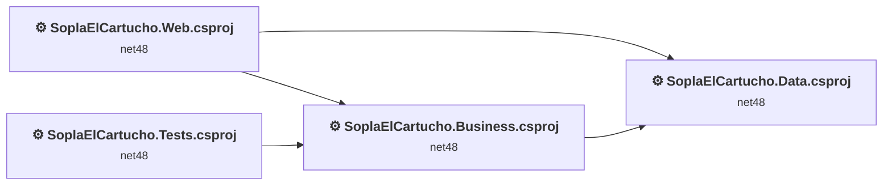
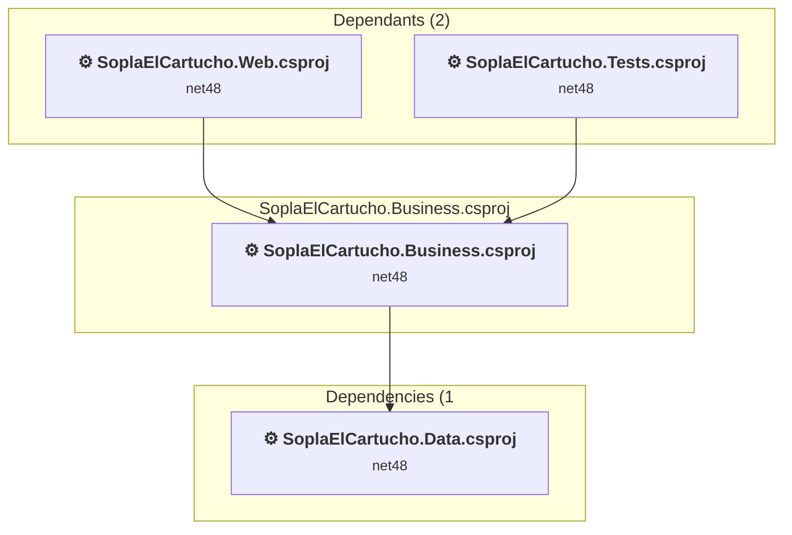
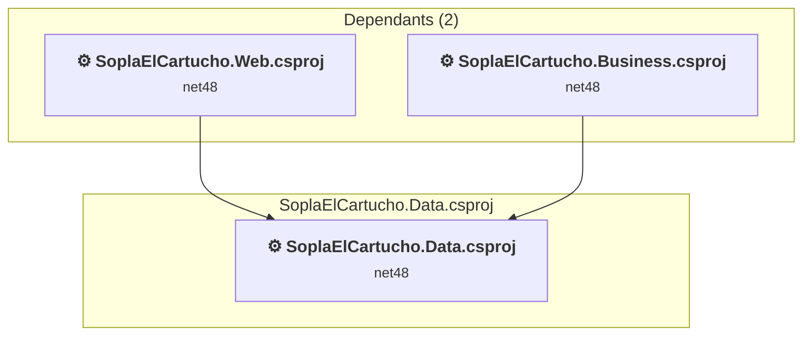
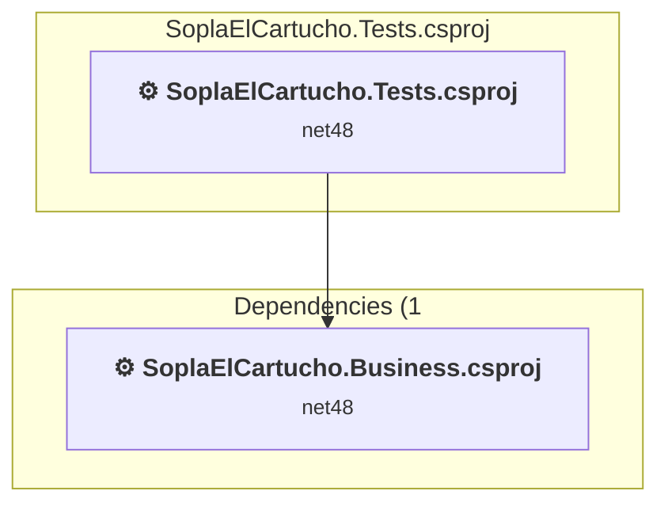
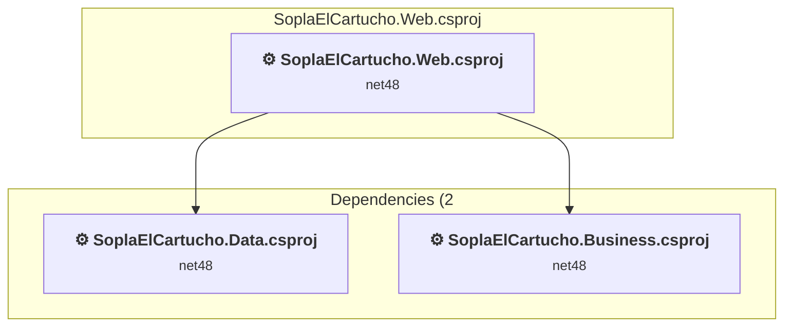

# Projects and dependencies analysis

This document provides a comprehensive overview of the projects and their dependencies in the context of upgrading to .NETCoreApp,Version=v10.0.

## Table of Contents

- [Executive Summary](#executive-Summary)
  - [Highlevel Metrics](#highlevel-metrics)
  - [Projects Compatibility](#projects-compatibility)
  - [Package Compatibility](#package-compatibility)
  - [API Compatibility](#api-compatibility)
- [Aggregate NuGet packages details](#aggregate-nuget-packages-details)
- [Top API Migration Challenges](#top-api-migration-challenges)
  - [Technologies and Features](#technologies-and-features)
  - [Most Frequent API Issues](#most-frequent-api-issues)
- [Projects Relationship Graph](#projects-relationship-graph)
- [Project Details](#project-details)

  - [SoplaElCartucho.Business\SoplaElCartucho.Business.csproj](#soplaelcartuchobusinesssoplaelcartuchobusinesscsproj)
  - [SoplaElCartucho.Data\SoplaElCartucho.Data.csproj](#soplaelcartuchodatasoplaelcartuchodatacsproj)
  - [SoplaElCartucho.Tests\SoplaElCartucho.Tests.csproj](#soplaelcartuchotestssoplaelcartuchotestscsproj)
  - [SoplaElCartucho.Web\SoplaElCartucho.Web.csproj](#soplaelcartuchowebsoplaelcartuchowebcsproj)

## Executive Summary

### Highlevel Metrics

| Metric | Count | Status |
| :--- | :---: | :--- |
| Total Projects | 4 | All require upgrade |
| Total NuGet Packages | 6 | All compatible |
| Total Code Files | 30 |  |
| Total Code Files with Incidents | 10 |  |
| Total Lines of Code | 2441 |  |
| Total Number of Issues | 445 |  |
| Estimated LOC to modify | 431+ | at least 17,7% of codebase |

### Projects Compatibility

| Project | Target Framework | Difficulty | Package Issues | API Issues | Est. LOC Impact | Description |
| :--- | :---: | :---: | :---: | :---: | :---: | :--- |
| [SoplaElCartucho.Business\SoplaElCartucho.Business.csproj](#soplaelcartuchobusinesssoplaelcartuchobusinesscsproj) | net48 | 🟢 Low | 0 | 0 |  | ClassicClassLibrary, Sdk Style = False |
| [SoplaElCartucho.Data\SoplaElCartucho.Data.csproj](#soplaelcartuchodatasoplaelcartuchodatacsproj) | net48 | 🟢 Low | 0 | 0 |  | ClassicClassLibrary, Sdk Style = False |
| [SoplaElCartucho.Tests\SoplaElCartucho.Tests.csproj](#soplaelcartuchotestssoplaelcartuchotestscsproj) | net48 | 🟢 Low | 0 | 0 |  | ClassicClassLibrary, Sdk Style = False |
| [SoplaElCartucho.Web\SoplaElCartucho.Web.csproj](#soplaelcartuchowebsoplaelcartuchowebcsproj) | net48 | 🔴 High | 4 | 431 | 431+ | Wap, Sdk Style = False |

### Package Compatibility

| Status | Count | Percentage |
| :--- | :---: | :---: |
| ✅ Compatible | 6 | 100,0% |
| ⚠️ Incompatible | 0 | 0,0% |
| 🔄 Upgrade Recommended | 0 | 0,0% |
| ***Total NuGet Packages*** | ***6*** | ***100%*** |

### API Compatibility

| Category | Count | Impact |
| :--- | :---: | :--- |
| 🔴 Binary Incompatible | 390 | High - Require code changes |
| 🟡 Source Incompatible | 41 | Medium - Needs re-compilation and potential conflicting API error fixing |
| 🔵 Behavioral change | 0 | Low - Behavioral changes that may require testing at runtime |
| ✅ Compatible | 1010 |  |
| ***Total APIs Analyzed*** | ***1441*** |  |

## Aggregate NuGet packages details

| Package | Current Version | Suggested Version | Projects | Description |
| :--- | :---: | :---: | :--- | :--- |
| Microsoft.AspNet.Mvc | 5.2.7 |  | [SoplaElCartucho.Web.csproj](#soplaelcartuchowebsoplaelcartuchowebcsproj) | NuGet package functionality is included with framework reference |
| Microsoft.AspNet.Razor | 3.2.7 |  | [SoplaElCartucho.Web.csproj](#soplaelcartuchowebsoplaelcartuchowebcsproj) | NuGet package functionality is included with framework reference |
| Microsoft.AspNet.WebPages | 3.2.7 |  | [SoplaElCartucho.Web.csproj](#soplaelcartuchowebsoplaelcartuchowebcsproj) | NuGet package functionality is included with framework reference |
| Microsoft.Web.Infrastructure | 1.0.0.0 |  | [SoplaElCartucho.Web.csproj](#soplaelcartuchowebsoplaelcartuchowebcsproj) | NuGet package functionality is included with framework reference |
| MSTest.TestAdapter | 3.1.1 |  | [SoplaElCartucho.Tests.csproj](#soplaelcartuchotestssoplaelcartuchotestscsproj) | ✅Compatible |
| MSTest.TestFramework | 3.1.1 |  | [SoplaElCartucho.Tests.csproj](#soplaelcartuchotestssoplaelcartuchotestscsproj) | ✅Compatible |

## Top API Migration Challenges

### Technologies and Features

| Technology | Issues | Percentage | Migration Path |
| :--- | :---: | :---: | :--- |
| ASP.NET Framework (System.Web) | 431 | 100,0% | Legacy ASP.NET Framework APIs for web applications (System.Web.*) that don't exist in ASP.NET Core due to architectural differences. ASP.NET Core represents a complete redesign of the web framework. Migrate to ASP.NET Core equivalents or consider System.Web.Adapters package for compatibility. |

### Most Frequent API Issues

| API | Count | Percentage | Category |
| :--- | :---: | :---: | :--- |
| P:System.Web.Mvc.ControllerBase.ViewBag | 43 | 10,0% | Binary Incompatible |
| T:System.Web.Mvc.ActionResult | 30 | 7,0% | Binary Incompatible |
| T:System.Web.Mvc.RedirectToRouteResult | 29 | 6,7% | Binary Incompatible |
| T:System.Web.Mvc.ViewResult | 22 | 5,1% | Binary Incompatible |
| T:System.Web.Mvc.TempDataDictionary | 21 | 4,9% | Binary Incompatible |
| P:System.Web.Mvc.ControllerBase.TempData | 21 | 4,9% | Binary Incompatible |
| P:System.Web.Mvc.TempDataDictionary.Item(System.String) | 21 | 4,9% | Binary Incompatible |
| M:System.Web.Mvc.Controller.RedirectToAction(System.String) | 16 | 3,7% | Binary Incompatible |
| T:System.Web.HttpSessionStateBase | 14 | 3,2% | Source Incompatible |
| P:System.Web.Mvc.Controller.Session | 14 | 3,2% | Binary Incompatible |
| M:System.Web.Mvc.Controller.View | 13 | 3,0% | Binary Incompatible |
| P:System.Web.HttpSessionStateBase.Item(System.String) | 12 | 2,8% | Source Incompatible |
| M:System.Web.Mvc.HttpPostAttribute.#ctor | 11 | 2,6% | Binary Incompatible |
| T:System.Web.Mvc.HttpPostAttribute | 11 | 2,6% | Binary Incompatible |
| P:System.Web.Mvc.Controller.User | 9 | 2,1% | Binary Incompatible |
| M:System.Web.Mvc.Controller.RedirectToAction(System.String,System.String) | 8 | 1,9% | Binary Incompatible |
| M:System.Web.Mvc.Controller.View(System.Object) | 8 | 1,9% | Binary Incompatible |
| M:System.Web.Mvc.ValidateAntiForgeryTokenAttribute.#ctor | 6 | 1,4% | Binary Incompatible |
| T:System.Web.Mvc.ValidateAntiForgeryTokenAttribute | 6 | 1,4% | Binary Incompatible |
| T:System.Web.Mvc.UrlParameter | 6 | 1,4% | Binary Incompatible |
| T:System.Web.Mvc.RouteCollectionExtensions | 6 | 1,4% | Binary Incompatible |
| M:System.Web.Mvc.Controller.#ctor | 5 | 1,2% | Binary Incompatible |
| T:System.Web.Mvc.Controller | 5 | 1,2% | Binary Incompatible |
| M:System.Web.Mvc.AllowAnonymousAttribute.#ctor | 5 | 1,2% | Binary Incompatible |
| T:System.Web.Mvc.AllowAnonymousAttribute | 5 | 1,2% | Binary Incompatible |
| T:System.Web.Mvc.JsonResult | 5 | 1,2% | Binary Incompatible |
| M:System.Web.Mvc.AuthorizeAttribute.#ctor | 4 | 0,9% | Binary Incompatible |
| T:System.Web.Mvc.AuthorizeAttribute | 4 | 0,9% | Binary Incompatible |
| M:System.Web.Mvc.Controller.Json(System.Object) | 4 | 0,9% | Binary Incompatible |
| M:System.Web.Mvc.Controller.RedirectToAction(System.String,System.Object) | 4 | 0,9% | Binary Incompatible |
| T:System.Web.Security.FormsAuthentication | 3 | 0,7% | Binary Incompatible |
| T:System.Web.Routing.Route | 3 | 0,7% | Binary Incompatible |
| M:System.Web.Mvc.RouteCollectionExtensions.MapRoute(System.Web.Routing.RouteCollection,System.String,System.String,System.Object) | 3 | 0,7% | Binary Incompatible |
| M:System.Web.Mvc.RouteCollectionExtensions.IgnoreRoute(System.Web.Routing.RouteCollection,System.String) | 3 | 0,7% | Binary Incompatible |
| T:System.Web.Mvc.ViewDataDictionary | 2 | 0,5% | Binary Incompatible |
| P:System.Web.Mvc.ControllerBase.ViewData | 2 | 0,5% | Binary Incompatible |
| P:System.Web.Mvc.ViewDataDictionary.Item(System.String) | 2 | 0,5% | Binary Incompatible |
| M:System.Web.Security.FormsAuthentication.SetAuthCookie(System.String,System.Boolean) | 2 | 0,5% | Binary Incompatible |
| T:System.Web.Mvc.JsonRequestBehavior | 2 | 0,5% | Binary Incompatible |
| T:System.Web.HttpRequestBase | 2 | 0,5% | Source Incompatible |
| P:System.Web.Mvc.Controller.Request | 2 | 0,5% | Binary Incompatible |
| T:System.Web.Mvc.AjaxRequestExtensions | 2 | 0,5% | Binary Incompatible |
| M:System.Web.Mvc.AjaxRequestExtensions.IsAjaxRequest(System.Web.HttpRequestBase) | 2 | 0,5% | Binary Incompatible |
| T:System.Web.SessionState.HttpSessionState | 2 | 0,5% | Source Incompatible |
| P:System.Web.HttpApplication.Session | 2 | 0,5% | Source Incompatible |
| P:System.Web.SessionState.HttpSessionState.Item(System.String) | 2 | 0,5% | Source Incompatible |
| T:System.Web.Routing.RouteCollection | 2 | 0,5% | Binary Incompatible |
| F:System.Web.Mvc.UrlParameter.Optional | 2 | 0,5% | Binary Incompatible |
| M:System.Web.Mvc.HttpGetAttribute.#ctor | 1 | 0,2% | Binary Incompatible |
| T:System.Web.Mvc.HttpGetAttribute | 1 | 0,2% | Binary Incompatible |

## Projects Relationship Graph

Legend:
📦 SDK-style project
⚙️ Classic project

## Project Details

### SoplaElCartucho.Business\SoplaElCartucho.Business.csproj

#### Project Info

- **Current Target Framework:** net48
- **Proposed Target Framework:** net10.0
- **SDK-style**: False
- **Project Kind:** ClassicClassLibrary
- **Dependencies**: 1
- **Dependants**: 2
- **Number of Files**: 4
- **Number of Files with Incidents**: 1
- **Lines of Code**: 93
- **Estimated LOC to modify**: 0+ (at least 0,0% of the project)

#### Dependency Graph

Legend:
📦 SDK-style project
⚙️ Classic project

### API Compatibility

| Category | Count | Impact |
| :--- | :---: | :--- |
| 🔴 Binary Incompatible | 0 | High - Require code changes |
| 🟡 Source Incompatible | 0 | Medium - Needs re-compilation and potential conflicting API error fixing |
| 🔵 Behavioral change | 0 | Low - Behavioral changes that may require testing at runtime |
| ✅ Compatible | 66 |  |
| ***Total APIs Analyzed*** | ***66*** |  |

### SoplaElCartucho.Data\SoplaElCartucho.Data.csproj

#### Project Info

- **Current Target Framework:** net48
- **Proposed Target Framework:** net10.0
- **SDK-style**: False
- **Project Kind:** ClassicClassLibrary
- **Dependencies**: 0
- **Dependants**: 2
- **Number of Files**: 4
- **Number of Files with Incidents**: 1
- **Lines of Code**: 81
- **Estimated LOC to modify**: 0+ (at least 0,0% of the project)

#### Dependency Graph

Legend:
📦 SDK-style project
⚙️ Classic project

### API Compatibility

| Category | Count | Impact |
| :--- | :---: | :--- |
| 🔴 Binary Incompatible | 0 | High - Require code changes |
| 🟡 Source Incompatible | 0 | Medium - Needs re-compilation and potential conflicting API error fixing |
| 🔵 Behavioral change | 0 | Low - Behavioral changes that may require testing at runtime |
| ✅ Compatible | 63 |  |
| ***Total APIs Analyzed*** | ***63*** |  |

### SoplaElCartucho.Tests\SoplaElCartucho.Tests.csproj

#### Project Info

- **Current Target Framework:** net48
- **Proposed Target Framework:** net10.0
- **SDK-style**: False
- **Project Kind:** ClassicClassLibrary
- **Dependencies**: 1
- **Dependants**: 0
- **Number of Files**: 3
- **Number of Files with Incidents**: 1
- **Lines of Code**: 79
- **Estimated LOC to modify**: 0+ (at least 0,0% of the project)

#### Dependency Graph

Legend:
📦 SDK-style project
⚙️ Classic project

### API Compatibility

| Category | Count | Impact |
| :--- | :---: | :--- |
| 🔴 Binary Incompatible | 0 | High - Require code changes |
| 🟡 Source Incompatible | 0 | Medium - Needs re-compilation and potential conflicting API error fixing |
| 🔵 Behavioral change | 0 | Low - Behavioral changes that may require testing at runtime |
| ✅ Compatible | 38 |  |
| ***Total APIs Analyzed*** | ***38*** |  |

### SoplaElCartucho.Web\SoplaElCartucho.Web.csproj

#### Project Info

- **Current Target Framework:** net48
- **Proposed Target Framework:** net10.0
- **SDK-style**: False
- **Project Kind:** Wap
- **Dependencies**: 2
- **Dependants**: 0
- **Number of Files**: 49
- **Number of Files with Incidents**: 7
- **Lines of Code**: 2188
- **Estimated LOC to modify**: 431+ (at least 19,7% of the project)

#### Dependency Graph

Legend:
📦 SDK-style project
⚙️ Classic project

### API Compatibility

| Category | Count | Impact |
| :--- | :---: | :--- |
| 🔴 Binary Incompatible | 390 | High - Require code changes |
| 🟡 Source Incompatible | 41 | Medium - Needs re-compilation and potential conflicting API error fixing |
| 🔵 Behavioral change | 0 | Low - Behavioral changes that may require testing at runtime |
| ✅ Compatible | 843 |  |
| ***Total APIs Analyzed*** | ***1274*** |  |

#### Project Technologies and Features

| Technology | Issues | Percentage | Migration Path |
| :--- | :---: | :---: | :--- |
| ASP.NET Framework (System.Web) | 431 | 100,0% | Legacy ASP.NET Framework APIs for web applications (System.Web.*) that don't exist in ASP.NET Core due to architectural differences. ASP.NET Core represents a complete redesign of the web framework. Migrate to ASP.NET Core equivalents or consider System.Web.Adapters package for compatibility. |

